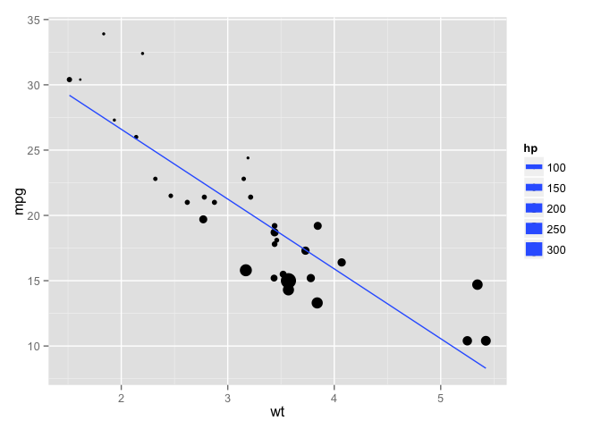

Introduction to `knitr`
=======================

> Programs are meant to be read by humans and only incidentally for computers to execute.

> -   Donald Knuth

Motivation
----------

The cut-and-paste approach to report production is tedious, slow, and error-prone. It can be very harmful to reproducible research and it is inconvenient to reproduce results.

`knitr` is an `R` package that integrates computing and reporting. By incorporating code into text documents, the analysis, results and discussion are all in one place. Files can then be processed into a diverse array of document formats, including the important ones for collaborative science: pdfs, Word documents, slide presentations, and web pages.

This is important for reproducible research because you can create reports, papers, presentations in which every table, figure, and inline result is generated by code that is tied to the document itself. It makes life easier when it comes time to make small updates to an analysis, and more importantly, the code becomes more understandable by virtue of being directly related to the text description.

### The importance of text

There are many advantages to creating scientific content using simple text documents. For one, they are future-proof. Microsoft and Apple are continually updating their software and document formats. In 5 years I probably won't be able to easily open a Word document that I created today, and likewise, when a new document format comes out (remember when .docx was new?) it takes a while for it to be widely adopted. It is highly unlikely that text documents will become obsolete. I can still open a text file that I created on my old Apple IIe. Secondly, content tracking tools like `git` and github work wonderfully with text files. It is dead-easy to view line-by-line changes in a text file.

Tools like `knitr`, `rmarkdown`, and pandoc do the hard work of translating your text files into "production" documents, like beautifully typeset pdfs, smooth presentations, and Word documents that your collaborators can't live without. Creating the base in a text file allows you to focus on the content and not obsess over the details like formatting and figure placement. This document was created with `knitr` in markdown. Check out the source code [here](http://github.com/sachsmc/knit-git-markr-guide/blob/master/knitr/knit.Rmd).

How to use `knitr`
------------------

The basic idea is that your text documents are interrupted by **chunks** of code that are identified in a special way. These chunks are evaluated by an `R` process in the order that they appear. `R` objects that are created by chunks remain in the enviroment for subsequent chunks. The code in the chunks is displayed and formatted in the document. The results printed by the code are also incorporated into the document as figures, tables, or other objects. Chunks can stand alone, or be included inline with text. Many options exist to format the code and the results, and the options can be extended in countless ways.

How exactly to use `knitr` depends on the input document format. First I will desribe how to use it with [**markdown**](http://daringfireball.net/projects/markdown/).

### `knitr` with markdown

When I say markdown I am referring to the plain text formatting syntax, as opposed to the software. Markdown is a syntax closely related to html. It is semanic, like html, but it is much less verbose. Markdown documents can in fact stand on there own as readable text documents without being rendered. Semantic means that elements of the document are described by what they represent, as opposed to how they should look. Thus, for a title, you indicate that this text is the title, as opposed to this text should be large font and in bold. Here is an example with the result:


Importantly, the markdown can stand on its own and continue to be readable even though it's a simple text file. Contrast that with the generated html:


Or the equivalent Latex:


Thus markdown has the dual advantages of being readble on it's own, and having associated tools to create other document formats from it. Math in markdown is just like math in Latex.

### Incorporating code chunks

In markdown, the start of a code chunk is indicated by three backticks and the end of a code chunk is indicated by three backticks. At the start of the chunk, you tell `knitr` what type of code it is, give the chunk a name, and other options:

    ```{r my-first-chunk, results='asis'}
    ## code goes in here
    ```

Inline code is similar, using single backticks instead. Inline code does not have names or options. For example, `r rnorm(10)`.

Here's an example of raw output using the `mtcars` dataset:

    ```{r mtcars-example}
    lm(mpg ~ hp + wt, data = mtcars)
    ```

    ## 
    ## Call:
    ## lm(formula = mpg ~ hp + wt, data = mtcars)
    ## 
    ## Coefficients:
    ## (Intercept)           hp           wt  
    ##     37.2273      -0.0318      -3.8778

And here's a plot

    ```{r mt-plot}
    library(ggplot2)
    ggplot(mtcars, aes(y = mpg, x = wt, size = hp)) + geom_point() + stat_smooth(method = "lm", se = FALSE)
    ```



The concept is very simple. Anything you want to do in `R` is incorporated into your document, the results alongside the code. The important details to learn are methods of controlling the output. This means making nice looking tables, decent figures, and formatting inline results. We will cover these topics next.

Controlling `R` output
======================

### Tables

When outputting tables in knitr, it is important to use the option `results = 'asis'`. There are several options for formatting tables in `R`. The `knitr` package includes a function called `kable` that makes basic **k**nitr t**ables**. There are options to control the number of digits, whether row names are included or not, column alignment, and other options that depend on the output type.

    ```{r kable, results = 'asis'}
    kable(head(mtcars), digits = 2, align = c(rep("l", 4), rep("c", 4), rep("r", 4)))
    ```

|id|mpg|cyl|disp|hp|drat|wt|qsec|vs|am|gear|carb|
|:--|:--|:--|:---|:--|:--:|:-:|:--:|:-:|--:|---:|---:|
|Mazda RX4|21.0|6|160|110|3.90|2.62|16.46|0|1|4|4|
|Mazda RX4 Wag|21.0|6|160|110|3.90|2.88|17.02|0|1|4|4|
|Datsun 710|22.8|4|108|93|3.85|2.32|18.61|1|1|4|1|
|Hornet 4 Drive|21.4|6|258|110|3.08|3.21|19.44|1|0|3|1|
|Hornet Sportabout|18.7|8|360|175|3.15|3.44|17.02|0|0|3|2|
|Valiant|18.1|6|225|105|2.76|3.46|20.22|1|0|3|1|

For finer control, use the `xtable` package. There are tons of options (see the help file), and the interface is a bit clunky. For instance some options are passed to `xtable`, while others are passed to `print.xtable`. The key one for markdown is to use `print(xtable(x), type = "html")`.

    ```{r xtable, results = 'asis'}
    library(xtable)
    print(xtable(head(mtcars)), type = "html")
    ```


<TABLE>
<TR> <TH>  </TH> <TH> 
mpg
</TH> <TH> 
cyl
</TH> <TH> 
disp
</TH> <TH> 
hp
</TH> <TH> 
drat
</TH> <TH> 
wt
</TH> <TH> 
qsec
</TH> <TH> 
vs
</TH> <TH> 
am
</TH> <TH> 
gear
</TH> <TH> 
carb
</TH>  </TR>
  <TR> <TD align="right"> 
Mazda RX4
</TD> <TD align="right"> 
21.00
</TD> <TD align="right"> 
6.00
</TD> <TD align="right"> 
160.00
</TD> <TD align="right"> 
110.00
</TD> <TD align="right"> 
3.90
</TD> <TD align="right"> 
2.62
</TD> <TD align="right"> 
16.46
</TD> <TD align="right"> 
0.00
</TD> <TD align="right"> 
1.00
</TD> <TD align="right"> 
4.00
</TD> <TD align="right"> 
4.00
</TD> </TR>
  <TR> <TD align="right"> 
Mazda RX4 Wag
</TD> <TD align="right"> 
21.00
</TD> <TD align="right"> 
6.00
</TD> <TD align="right"> 
160.00
</TD> <TD align="right"> 
110.00
</TD> <TD align="right"> 
3.90
</TD> <TD align="right"> 
2.88
</TD> <TD align="right"> 
17.02
</TD> <TD align="right"> 
0.00
</TD> <TD align="right"> 
1.00
</TD> <TD align="right"> 
4.00
</TD> <TD align="right"> 
4.00
</TD> </TR>
  <TR> <TD align="right"> 
Datsun 710
</TD> <TD align="right"> 
22.80
</TD> <TD align="right"> 
4.00
</TD> <TD align="right"> 
108.00
</TD> <TD align="right"> 
93.00
</TD> <TD align="right"> 
3.85
</TD> <TD align="right"> 
2.32
</TD> <TD align="right"> 
18.61
</TD> <TD align="right"> 
1.00
</TD> <TD align="right"> 
1.00
</TD> <TD align="right"> 
4.00
</TD> <TD align="right"> 
1.00
</TD> </TR>
  <TR> <TD align="right"> 
Hornet 4 Drive
</TD> <TD align="right"> 
21.40
</TD> <TD align="right"> 
6.00
</TD> <TD align="right"> 
258.00
</TD> <TD align="right"> 
110.00
</TD> <TD align="right"> 
3.08
</TD> <TD align="right"> 
3.21
</TD> <TD align="right"> 
19.44
</TD> <TD align="right"> 
1.00
</TD> <TD align="right"> 
0.00
</TD> <TD align="right"> 
3.00
</TD> <TD align="right"> 
1.00
</TD> </TR>
  <TR> <TD align="right"> 
Hornet Sportabout
</TD> <TD align="right"> 
18.70
</TD> <TD align="right"> 
8.00
</TD> <TD align="right"> 
360.00
</TD> <TD align="right"> 
175.00
</TD> <TD align="right"> 
3.15
</TD> <TD align="right"> 
3.44
</TD> <TD align="right"> 
17.02
</TD> <TD align="right"> 
0.00
</TD> <TD align="right"> 
0.00
</TD> <TD align="right"> 
3.00
</TD> <TD align="right"> 
2.00
</TD> </TR>
  <TR> <TD align="right"> 
Valiant
</TD> <TD align="right"> 
18.10
</TD> <TD align="right"> 
6.00
</TD> <TD align="right"> 
225.00
</TD> <TD align="right"> 
105.00
</TD> <TD align="right"> 
2.76
</TD> <TD align="right"> 
3.46
</TD> <TD align="right"> 
20.22
</TD> <TD align="right"> 
1.00
</TD> <TD align="right"> 
0.00
</TD> <TD align="right"> 
3.00
</TD> <TD align="right"> 
1.00
</TD> </TR>
</TABLE>


The `stargazer` package creates good-looking tables with minimal effort. It is especially useful for summarizing a series of regression models. See the help files for all the available options.

    ```{r star, results = 'asis', warning=FALSE, message=FALSE}
    library(stargazer, quietly = TRUE)
    fit1 <- lm(mpg ~ wt, mtcars)
    fit2 <- lm(mpg ~ wt + hp, mtcars)
    fit3 <- lm(mpg ~ wt + hp + disp, mtcars)
    stargazer(fit1, fit2, fit3, type = 'html')
    ```

<table style="text-align:center"><tr><td colspan="4" style="border-bottom: 1px solid black"></td></tr><tr><td style="text-align:left"></td><td colspan="3">
<em>Dependent variable:</em>
</td></tr>
<tr><td></td><td colspan="3" style="border-bottom: 1px solid black"></td></tr>
<tr><td style="text-align:left"></td><td colspan="3">
mpg
</td></tr>
<tr><td style="text-align:left"></td><td>
(1)
</td><td>
(2)
</td><td>
(3)
</td></tr>
<tr><td colspan="4" style="border-bottom: 1px solid black"></td></tr><tr><td style="text-align:left">
wt
</td><td>
-5.344<sup>\*\*\*</sup>
</td><td>
-3.878<sup>\*\*\*</sup>
</td><td>
-3.801<sup>\*\*\*</sup>
</td></tr>
<tr><td style="text-align:left"></td><td>
(0.559)
</td><td>
(0.633)
</td><td>
(1.066)
</td></tr>
<tr><td style="text-align:left"></td><td></td><td></td><td></td></tr>
<tr><td style="text-align:left">
hp
</td><td></td><td>
-0.032<sup>\*\*\*</sup>
</td><td>
-0.031<sup>\*\*</sup>
</td></tr>
<tr><td style="text-align:left"></td><td></td><td>
(0.009)
</td><td>
(0.011)
</td></tr>
<tr><td style="text-align:left"></td><td></td><td></td><td></td></tr>
<tr><td style="text-align:left">
disp
</td><td></td><td></td><td>
-0.001
</td></tr>
<tr><td style="text-align:left"></td><td></td><td></td><td>
(0.010)
</td></tr>
<tr><td style="text-align:left"></td><td></td><td></td><td></td></tr>
<tr><td style="text-align:left">
Constant
</td><td>
37.280<sup>\*\*\*</sup>
</td><td>
37.230<sup>\*\*\*</sup>
</td><td>
37.110<sup>\*\*\*</sup>
</td></tr>
<tr><td style="text-align:left"></td><td>
(1.878)
</td><td>
(1.599)
</td><td>
(2.111)
</td></tr>
<tr><td style="text-align:left"></td><td></td><td></td><td></td></tr>
<tr><td colspan="4" style="border-bottom: 1px solid black"></td></tr><tr><td style="text-align:left">
Observations
</td><td>
32
</td><td>
32
</td><td>
32
</td></tr>
<tr><td style="text-align:left">
R<sup>2</sup>
</td><td>
0.753
</td><td>
0.827
</td><td>
0.827
</td></tr>
<tr><td style="text-align:left">
Adjusted R<sup>2</sup>
</td><td>
0.745
</td><td>
0.815
</td><td>
0.808
</td></tr>
<tr><td style="text-align:left">
Residual Std. Error
</td><td>
3.046 (df = 30)
</td><td>
2.593 (df = 29)
</td><td>
2.639 (df = 28)
</td></tr>
<tr><td style="text-align:left">
F Statistic
</td><td>
91.380<sup>\*\*\*</sup> (df = 1; 30)
</td><td>
69.210<sup>\*\*\*</sup> (df = 2; 29)
</td><td>
44.570<sup>\*\*\*</sup> (df = 3; 28)
</td></tr>
<tr><td colspan="4" style="border-bottom: 1px solid black"></td></tr><tr><td style="text-align:left">
<em>Note:</em>
</td><td colspan="3" style="text-align:right">
<sup>*</sup>p\<0.1; <sup>**</sup>p\<0.05; <sup>***</sup>p\<0.01
</td></tr>
</table>


For long-running computations, a useful chunk option is `cache = TRUE`. This creates a folder called cache in your working directory that will store the results of the computation after the first time you run it. After that, re-knitting the document is fast.

### Figures

### Inline results

Output formats
==============

### Pandoc

The folks at [Rstudio](http://rstudio.org) have worked hard to bundle `knitr` with [pandoc](http://johnmacfarlane.net/pandoc/), a universal document converter. Pandoc allows you to take markdown documents and convert them to almost any file format, docx, pdf, html, and much more. Furthermore, you can even convert markdown to Tex, which comes in handy for journal submission. Previously, if you wanted html output, you wrote a report in rmarkdown or rhtml and if you wanted a pdf, you had to start over with a .Rnw file. Now we can seamlessly switch between formats. The key is in defining what you want in the **front matter** of your document.

At the top of your markdown file, all of the pandoc parameters are put between `---` delimeters. For example, in this document, I have

    ---
    title: "knitr"
    author: Michael Sachs
    output: 
      md_document:
        variant: markdown_github
    ---

This is the front-matter, and it is in `yaml` format. Rstudio passes these options to pandoc to convert my document to the appropriate format, after knitting. See all of the possible options here <http://rmarkdown.rstudio.com>.

For example, if I want pdf output, keeping the intermediate tex file I would use

    ---
    title: "knitr"
    author: Michael Sachs
    output: 
      pdf_document:
        keep_tex: true
    ---

Other commond document formats are `word_document`, `html_document`, and `beamer_presentation`. You can include a bibliography in a variety of formats, including `.bib`, with the `bibliography: myfile.bib` option. Include citations with the `@auth99` syntax.

To recap, this diagram illustrates my typical workflow. I start with a .Rmd, an r-markdown document with code, background, and descriptions. `knitr` does the work to evaluate the code, putting the results in a markdown document, which can then be converted to a variety of formats with pandoc. To extract the R code from the original document I use the `knitr::purl` function. I can then easily incorporate the code chunks into other document types, like presentations.


Resources
=========

### Installation

### Help
